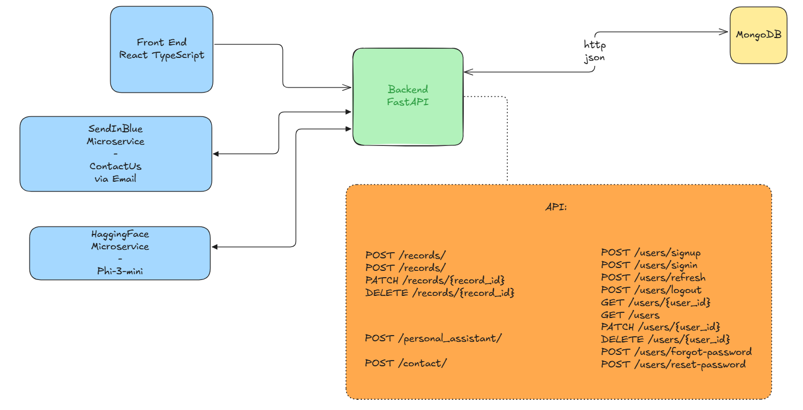

# Personal Finance API

*A comprehensive personal finance management solution powered by AI, MongoDB, and microservices architecture.*

**Technologies:** FastAPI • React • MongoDB • Docker • Docker Compose • Uvicorn • Hugging Face Phi 3 Mini • Sendinblue

---

## Table of Contents

- [Overview](#overview)
- [Architecture](#architecture)
- [Features](#features)
- [Setting Up the Project](#setting-up-the-project)
- [Docker Deployment with Docker Compose](#docker-deployment-with-docker-compose)
  - [Running the Application Locally](#running-the-application-locally)
- [API Documentation](#api-documentation)
- [Running Tests](#running-tests)
- [License](#license)

---

## Overview

Personal Finance API is a full-stack application that enables users to manage their finances securely and efficiently. The robust FastAPI backend provides financial tracking, user authentication, and personalized AI-driven insights, while MongoDB stores user and financial data. The modern React frontend delivers a responsive and intuitive user experience. Additionally, Sendinblue is integrated for email communications on the Contact Us page, and Hugging Face Phi 3 Mini powers a personal assistant for tailored financial advice. The entire solution is containerized using Docker and orchestrated with Docker Compose, ensuring consistent deployments and simplified testing.

---

## Architecture

Below is the system architecture diagram illustrating how the various components interact:



Key components include:

- **Frontend (React + TypeScript):** An interactive interface for managing records and user accounts.
- **Backend (FastAPI):** A RESTful API handling authentication, financial tracking, and AI-driven insights.
- **MongoDB:** Stores user and financial data in a flexible document-based schema.
- **Sendinblue:** Manages email sending for contact forms and notifications.
- **Hugging Face Phi 3 Mini:** Powers the personal assistant functionality, delivering tailored financial recommendations.
- **SLR Service (FastAPI):** A separate microservice (if applicable) for specialized tasks.

---

## Features

- **Financial Tracking:**  
  Monitor your balances, incomes, and expenses with precision.

- **Personalized Insights:**  
  Receive actionable, AI-driven financial advice tailored to your financial data.

- **User Authentication:**  
  Secure registration, login, and account management protect user data.

- **MongoDB Integration:**  
  Efficiently store and manage user and financial records using MongoDB.

- **Email Services with Sendinblue:**  
  Handle contact requests and email notifications seamlessly.

- **AI-Powered Personal Assistant:**  
  Leverage Hugging Face Phi 3 Mini to provide personalized financial recommendations.

- **Containerized Deployment:**  
  Docker and Docker Compose guarantee consistent environments and simplify deployment.

- **Integrated Testing:**  
  Run backend tests (e.g., using pytest) and frontend tests (e.g., using Jest) in isolated container environments.

---

## Setting Up the Project

### 1. Clone the Repository

Clone the repository and navigate to the project folder:

```bash
git clone https://github.com/Roee104/personal-finance-api.git
cd personal-finance-api
```

### 2. Configure Environment Variables

Copy the provided `.env.example` file to create your own `.env` file at the project root. Then update the values as needed:

```bash
cp .env.example .env
```

*Ensure your `.env` file is excluded from version control to keep sensitive information secure.*

---

## Docker Deployment with Docker Compose

### Prerequisites

- [Docker](https://docs.docker.com/get-docker/)
- [Docker Compose](https://docs.docker.com/compose/install/)

### Running the Application Locally

For development and testing, use Docker Compose to build and start the containers:

```bash
docker-compose up --build
```

This command will:
- Build the backend and frontend Docker images.
- Start the backend API (accessible at [http://localhost:8000](http://localhost:8000)).
- Start the frontend application (accessible at [http://localhost:3000](http://localhost:3000)).

To stop the services, run:

```bash
docker-compose down
```

---

## API Documentation

Once the backend is running, interactive API documentation is automatically generated via FastAPI. Access it at:

- **Swagger UI:** [http://localhost:8000/docs](http://localhost:8000/docs)
- **ReDoc:** [http://localhost:8000/redoc](http://localhost:8000/redoc)

These endpoints detail each API route, including request and response formats.

---

## Running Tests

### Backend Tests

Execute your backend tests (e.g., using pytest) within the Docker environment:

```bash
docker-compose run --rm backend pytest
```

### Frontend Tests

Run your containerized frontend tests (e.g., using Jest and React Testing Library) with:

```bash
docker-compose run --rm frontend_test
```

These commands ensure that tests run in an environment identical to your production setup.

---

## License

This project is licensed under the [MIT License](LICENSE).

---

*Happy managing your finances with Personal Finance API!*
